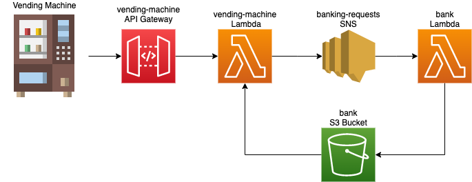

# Vending Machine

This is an app for calculating the change required for a given monetary value with the minimum number of coins possible.  
It contains two implementations of the vending machine; one that uses coins from a properties-file and one which is deployable to AWS and runs as a fully scalable service.

## Methodology
This application uses an implementation of the 'Greedy Algoritm' to find the minimum number of coins to return the required change, i.e. for each coin we choose the highest available coin with a denomination not greater than the total change required.  
This algorithm gives the optimal solution for this problem using the British coin system but may not work with other denominations of coin.  
More can be read about the Greedy Algorithm here: https://en.wikipedia.org/wiki/Greedy_algorithm

## Local Running
You can run the properties file version of the app by running the Main method in `./src/main/java/com/tenx/banking/core/local/Main`  
This version gets coins from a properties-file, takes requests from standard input and returns change, subtracting coins from the file as they are given.

## AWS Application
This application is also deployable as an AWS Serverless App consisting of an API Gateway, two Lambda functions, an SNS topic and an S3 Bucket.  

Architecture diagram:
 <!-- .element height="50%" width="50%" -->  


The API Gateway can receive http POST requests that include a vending machine id, and the amount of change required. It passes these requests on to a Lambda Function to process.  
The vending machine function will get the coin inventory for the given id from S3 and try to return you the optimal change.  
If this is not possible, either because that vending machine has never been used before or has been used so much that it is out of coins then the machine will send a request via SNS for more money to be added to its inventory.  
The bank function is subscribed to these notifications and will top up the inventory as required, so that the next customer can be served with some coins.

## Non-Functional Considerations
* API Gateway, Lambda and S3 are all highly scalable, highly available on demand services
* The API Gateway has a usage plan attached, with a rate-limited API key for authentication
* IAM roles and policies are used to ensure that the app complies to the Principle of Least Priviledge - each component can only do what it needs to.

Potential improvements to the design:
* The Java Lambdas are prone to cold starts on their initial requests. This could be mitigated with keep warm cloudwatch events or provisioned concurrency
* The only auth is currently an API key. We could add a custom authoriser or connect to a Cognito user pool to add extra security.
* S3 was used for storing state for simplicity but it should probably be a NoSQL DB such as DynamoDB for improved performance. Also, locking should be implemented on the DB so that two Lambda Functions can't access the coin inventory for the same vending machine at once.
* A custom domain name should be added via Route53  
* The bank Lambda could be changed to stream off the S3 bucket and proactively top up coin inventories rather than waiting for them to run out.

## Build and Deploy

To build the Gradle project and run unit tests in the command line, cd into the root of the project and run

```gradle clean build```

To deploy to AWS via terraform, cd into the terraform directory and run
```
terraform init
terraform plan
terraform apply
```
You will be prompted for the following inputs:  
* account_id : This is the account id of your aws account
* access_key : This is the access key for your aws iam user, found in the iam section of the AWS Console
* secret_key : This is the secret key for your aws iam user, found in the iam section of the AWS Console
* bucket_name: This is the name of the 'bank' bucket used by the app. S3 buckets are named globally so unfortunately a different one must be used for each deployment of the app

After terraform has successfully run it will output the URL of the API, and also the API key to access it

## Try it out!
You will be given a URL for your API from the terraform output, or you can hit the one already deployed in my account here:  
```https://ogyjdz89t0.execute-api.eu-west-1.amazonaws.com/dev/vend```  

You will need to include a header of `x-api-key` with the API key to access the API. You can request a key from me at `jmunro89 at gmail dot com`

The request should be of type POST and should contain fields `vendingMachineId` (type String) and `change` (type Int).

### Example Request
```
{
	"vendingMachineId": "123",
	"change": 42
}
```

### Example Responses
SUCCESS:
```
{
    "message": "Here's your change. Have a nice day :)",
    "coins": [
        "TWENTY_PENCE",
        "TWENTY_PENCE",
        "TWO_PENCE"
    ]
}
```
FAIL:
```
{
    "message": "Sorry, I don't have enough coins to give you change. I am requesting more coins from the bank, please try again shortly",
    "coins": null
}
```
If you receive this message then wait a few seconds for the bank to refill the inventory and try again.

## Still TODO
* Test coverage is poor on the AWS components (no tests in the api package and the S3 manager is untested).   
Given the time I had I decided to focus on making the app deployable rather than test coverage. The coverage of the main app business logic is better.
* Integration testing
* Implement gitflow and version tagging